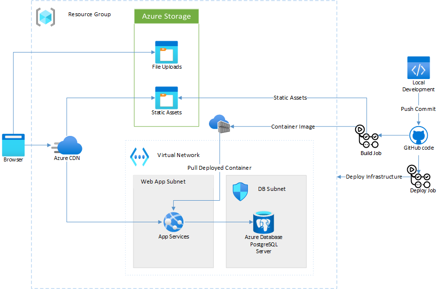

# Core Startup Stack Sample App – Rails

This repository demonstrates the Core Startup Stack – a set of infrastructure designed to get your app deployed in a robust, production-ready way with a minimum of fuss.



## Deploying the Startup Stack Sample App

### Fork this repository

Fork this repository into your own account (GitHub has [more information about forking repos](https://docs.github.com/en/get-started/quickstart/fork-a-repo))

### Clone the repository

Now clone this to your local machine or your Azure Cloud Shell. Here is [how to do this](https://docs.github.com/en/github/creating-cloning-and-archiving-repositories/cloning-a-repository-from-github/cloning-a-repository) from GitHub, or if you're using Visual Studio Code here are [instructions](https://code.visualstudio.com/docs/editor/github).

### Create a resource group and service principal

Either using [Azure Cloud Shell](https://docs.microsoft.com/azure/cloud-shell/overview) or the [Azure CLI](https://docs.microsoft.com/cli/azure/) on your local machine, first create a resource group to use for this project.
Replace the values `startupstack-demo` and `westus2` with a resource group name and location of your choosing.

```azurecli
az group create --name startupstack-demo --location westus2
```

Create a service principal for the deployment. This allows you to give permissions to GitHub Actions to deploy resources on your behalf, but only within the scope of the resource group you have created.

```azurecli
RESOURCE_GROUP_ID=$(az group show --name startupstack-demo --query id -o tsv)
az ad sp create-for-rbac --name startupstack-gh --role "Contributor" \
    --scope $RESOURCE_GROUP_ID --sdk-auth
```

The response will look something like the below JSON object. This response contains secrets which can be used to authenticate with Azure, so keep it secure for later steps.

```azurecli
{
"clientId": "...",
"clientSecret": "...",
"subscriptionId": "...",
"tenantId": "...",
...
}
```

After creating the service principal, we need to give it an additional role so our infrastructure template can assign roles within the scope of the resource group.

```azurecli
SP_ID=$(az ad sp list --display-name startupstack-gh --query [0].objectId -o tsv)
az role assignment create --assignee-object-id $SP_ID \
    --role "User Access Administrator" \
    --scope $RESOURCE_GROUP_ID \
    --assignee-principal-type "ServicePrincipal"
```

### Deploy the initial infrastructure

Run the below commands to deploy, and don't forget to replace `<DATABASE PASSWORD>` with something more secure.

```azurecli
cd startup-stack-rails
az deployment group create --resource-group startupstack-demo \
    --template-file infrastructure/startup-stack.bicep \
    --parameters @infrastructure/params-production.json dbPassword="<DATABASE PASSWORD>" deploymentSpId=$SP_ID
```

### Configure the Secrets

1. Navigate to your repository on GitHub
2. Select **Settings > Secrets > New repository secret**
3. Paste the entire JSON output that you saved earlier. Give the secret the name `AZURE_CREDENTIALS`.
4. Create another secret named `AZURE_RG`. Add the name of the resource group you created (in the above example it is `startupstack-demo`) to the secret's value field.
5. Create another secret named `DB_PASSWORD`. Add the database password you used when initially deploying the infrastructure to the secret's value field.

### Run the action

1. Navigate to your repository on GitHub
2. Select **Actions** and choose **Build and Deploy** from the list
3. Click **Run Workflow**.

NB There will be a warning about workflows not being enabled on forked repository - you will need to enable workflows.

This will take about 10 minutes to complete on the first run. Subsequent runs will be faster due to caching of the Docker build.

Once the build has run successfully, you can find the URL of your freshly deployed site:

1. Click on the run which has completed
2. Select the **deploy** step
3. Disclose the logs from the **Success!** step. The log messages will include details of your deployed app:

```
Successfully deployed using the Startup Stack.
Webapp name: startup-stack-demovdwf5c-webapp
URL: https://startup-stack-demovdwf5c-app.azureedge.net
Connect to the app via ssh using this command:
az webapp ssh -n startup-stack-demovdwf5c-webapp -g <RESOURCE GROUP NAME>
```

_Note: The CDN may take 10-15 minutes to initially propagate to all edge locations_

### Load the initial data

Locate the logs from running the action and within the **Success** find the command for connecting via ssh. Replace `<RESOURCE GROUP NAME>` with the name of the resource group you created and run the command in Azure Cloud Shell.

```azurecli
az webapp ssh -n startup-stack-demo -g <RESOURCE GROUP NAME>
```

Inside the ssh session which is established, setup the database.

```azurecli
cd /app
DISABLE_DATABASE_ENVIRONMENT_CHECK=1 bundle exec rails db:setup
```

### Testing the app

You can navigate to the app using the included in the URL returned as part of the deployment logs. Select **Login** from the top navigation and log in with the email `example@railstutorial.org` and password `foobar` to use the demo application.

### Clean Up

Once you are finished with testing the app, to avoid accruing costs you should clean up the infrastructure.

Run this command to remove the deployment group and all the resources in it:

```azurecli
az group delete -g <RESOURCE GROUP NAME>
```

## About the Sample App

This sample app is built around the reference app from Michael Hart's [Rails Tutorial](https://railstutorial.org). We chose it as it has real functionality but is simple enough not to be a distraction. You can read the [original readme](./README-ORIG.md) for more details about the app.

The core idea of the Startup Stack is that whatever stack you choose, so long as you can build it with a Dockerfile, then it can be deployed successfully in a robust, production-ready way with the Startup Stack.

## Legal

### Trademarks

This project may contain trademarks or logos for projects, products, or services. Authorized use of Microsoft trademarks or logos is subject to and must follow Microsoft’s Trademark & Brand Guidelines. Use of Microsoft trademarks or logos in modified versions of this project must not cause confusion or imply Microsoft sponsorship. Any use of third-party trademarks or logos are subject to those third-party’s policies.

### Data Collection

The software may collect information about you and your use of the software and send it to Microsoft. Microsoft may use this information to provide services and improve our products and services. You may turn off the telemetry as described in the repository. There are also some features in the software that may enable you and Microsoft to collect data from users of your applications. If you use these features, you must comply with applicable law, including providing appropriate notices to users of your applications together with a copy of Microsoft’s privacy statement. Our privacy statement is located at https://go.microsoft.com/fwlink/?LinkID=824704. You can learn more about data collection and use in the help documentation and our privacy statement. Your use of the software operates as your consent to these practices.
